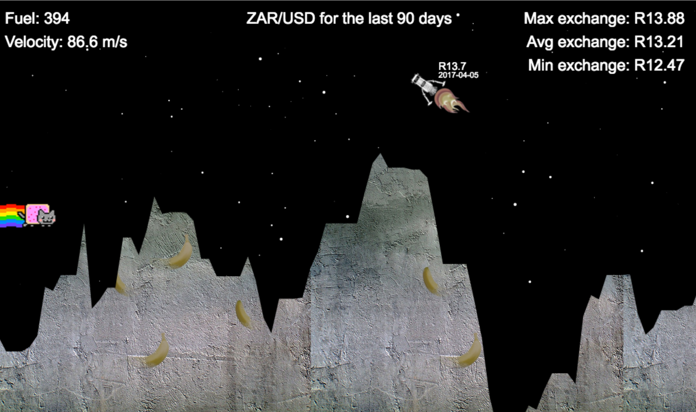

# lunar-rander
It's just like Lunar lander (well, not really, kinda an arm-length estimate), but on the surface of the USD/ZAR exchange rate.

Uses arrow keys to navigate on desktop, and phone rotation / touch to navigate on mobile.

On load, it pulls the last 90 days (which may take a while, we need a loading screen) of data, caches it in localStorage (whew),
then lets you try land a modified taxi on it.

Financial data is coming from fixer.io, everything else is hacked together.

Thanks to [@sabzsgizo](https://twitter.com/sabzsgizo) for fixing my financial data display mess (the currency value floating by the ship).

Just to prove this lander had dreams, once, of being the top of a minibus.

